&emsp; This project presents a 3D eddy current modeling system.  

| 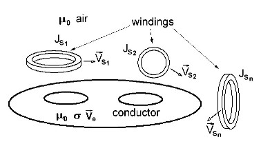  |
|  :-:                                                      |
| Fig.1. The general scheme of the geometric location of the calculation domains.|
  
&emsp;In the air environment there are **n** windings with a given current density $\vec{J_{s1}},...\vec{J_{sn}}$ and which can move at arbitrary speeds $\vec{V_{s1}},...\vec {V_{sn}}$. The conducting region has a given conductivity $\sigma$ and has a given magnetic permeability of air $\mu_0$, and can also move at a constant speed $\vec{V}_{e}$.   
&emsp; Partial differential equations are solved in the time domain with respect to the magnetic vector potential $\vec A$ and the electric scalar potential $U$.  
   
<a id="eq1">**Equations of non-conducting region:**</a>
<table><tr> 
<td>

$$D\left( \frac {\partial^2 A_x}{\partial x^2} + \frac{\partial^2 A_x}{\partial y^2} + \frac{\partial^2 A_x}{\partial z^2} \right) = -\mu_0 J_{sx}(x,y,x,t)$$
  
$$D\left( \frac {\partial^2 A_y}{\partial x^2} + \frac{\partial^2 A_y}{\partial y^2} + \frac{\partial^2 A_y}{\partial z^2} \right) = -\mu_0 J_{sy}(x,y,x,t) $$ 
  
$$D\left( \frac {\partial^2 A_z}{\partial x^2} + \frac{\partial^2 A_z}{\partial y^2} + \frac{\partial^2 A_z}{\partial z^2} \right) = -\mu_0 J_{sz}(x,y,x,t) $$

</td>
</tr></table>  
  
<a id="eq2">**Equations of conducting region:**</a>
<table><tr> 
<td>

$$D\left( \frac {\partial^2 A_x}{\partial x^2} + \frac{\partial^2 A_x}{\partial y^2} + \frac{\partial^2 A_x}{\partial z^2} \right) - C  \left( \frac {\partial A_x}{\partial t} + V_{ex} \frac {\partial A_x}{\partial x} + V_{ey} \frac{\partial A_x}{\partial y} + V_{ez} \frac{\partial A_x}{\partial z}  + \frac{\partial U}{\partial x} \right) = 0$$

$$D\left( \frac {\partial^2 A_y}{\partial x^2} + \frac{\partial^2 A_y}{\partial y^2} + \frac{\partial^2 A_y}{\partial z^2} \right) - C  \left( \frac {\partial A_y}{\partial t} + V_{ex} \frac {\partial A_y}{\partial x} + V_{ey} \frac{\partial A_y}{\partial y} + V_{ez} \frac{\partial A_y}{\partial z}  + \frac{\partial U}{\partial y} \right) = 0$$

$$D\left( \frac {\partial^2 A_z}{\partial x^2} + \frac{\partial^2 A_z}{\partial y^2} + \frac{\partial^2 A_z}{\partial z^2} \right) - C  \left( \frac {\partial A_z}{\partial t} + V_{ex} \frac {\partial A_z}{\partial x} + V_{ey} \frac{\partial A_z}{\partial y} + V_{ez} \frac{\partial A_z}{\partial z} + \frac{\partial U}{\partial z}  \right) = 0$$
  
$$\left(\frac {\partial^2 U}{\partial x^2} + \frac{\partial^2 U}{\partial y^2} + \frac{\partial^2 U}{\partial z^2} \right) + \frac {\partial}{\partial x} \frac{\partial A_x}{\partial t} + \frac {\partial}{\partial y} \frac{\partial A_y}{\partial t} + \frac {\partial}{\partial z} \frac{\partial A_z}{\partial t}=0$$

</td>
</tr></table>
  
&emsp; In the given equations $D=1$ is the diffusion coefficient, $C=\mu_0\sigma$ is the inertial coefficient.  
  
&emsp; Boundary conditions: open boundaries for magnetic vector potential.   For the electric scalar potential, zero Neumann conditions for the normal component at the boundary of the conducting region. Also at the boundary of the conducting region, zero normal components for eddy currents.  
&emsp;Using finite difference approximation, the equations are reduced to a system of algebraic equations, which are solved by the Biconjugate Gradient Stabilized with restart method  (_BiCGSTABwr_),for sparse matrices. 
This approach was discussed [here](https://github.com/JNSresearcher/calc_fields_3d) and [here](https://github.com/JNSresearcher/SOLVERS_BCGSTAB_GMRES).  
&emsp;  In numerical calculations for a non-conducting region, to determine the $x,y,z-$ coordinates of the location of external current sources in the coils at time step $i+1$, equations of the form $x_{i+1}=x_i + Vs _x\cdot dt$ are used, where $Vs _x$ is the speed of movement of the coil, $dt$ - calculated time step. Similarly, for the remaining coordinates, the speeds of mechanical movement of the coils must be specified: $Vs_y, Vs_z$.   

### Required Software 
Assembly and testing were done in _Windows_ (but _Linux_ is not excluded).  
- The simplest 3D editor is used to prepare the data [**VoxCad**](https://sourceforge.net/projects/voxcad/files/VoxCAD1000-x64.msi/download)  ([here](https://sourceforge.net/projects/voxcad/files/VoxCad0992.tar.gz/download) is a version for  **Linux**);   
- **gfortran** or **ifort** (both Fortran2018);   
- **Python** (optional) - for data decompression ( I used  **Python** as part of **Anaconda**, which includes the **zlib** library for **Python**). 					If the **vxc** file contains data in uncompressed ASCII format, then there is no need for **Python**. For example, on can use an analogue of [**Voxcraft-viz**](https://github.com/voxcraft/voxcraft-viz) with better 3D graphics and which stores data in ASCII by default;  
- **make** - for build;  
- [**ParaView**](https://www.paraview.org/) - to display calculation results in files in **vtk** format.  

### Repository Structure
Directory **/src**:  

- **EC3D.f90**  - main program;   
- **m_vxc2data.f90** - module for sharing data obtained when converting data from a **VoxCad** file;  
- **vxc2data.f90** - program for converting data from a **VoxCad** file;   
- **solvers.f90** - linear equation solver using  _BiCGSTABwr_ methods ;  
- **utilites.f90** - contains routines for different tasks (convert a string to an array of words, convert to upper case, representation of a 3D image in **vtk**, converting a word to a number;  
- **m_fparser.f90** - parser for calculating functions specified in the lines of a **VoxCad** file. Adapted from source files, available from <http://fparser.sourceforge.net>;   
- **uncompress_zlib.py** - for create a temporary file with converted uncompressed data into ACSII for later processing;  
-  **Makefile** - creating an executable using **make**.  

&emsp;Files in **VoxCad** format with examples of tasks for calculations in the time domain:  

- **compare_to_Elmer.vxc** - for solve the test problem and compare the results with **Elmer FEM**;  
- **ec_src_move_hole.vxc** - example of a moving coil;  
- **LIM.vxc** - example with a linear induction machine.  

Directory **/for_ElmerFEM** contains archives for comparative calculations in **ElmerFEM**.

### Build  
&emsp; To build the  executable file **EC3D.exe**, should be configure the **makefile**. The executable file can be created using the **gfortran** or **ifort** compilers. To configure, on need to comment/uncomment the top lines, for example, for  **gfortran**:   
```
        F90=gfortran  
        # F90=ifort
```  
&emsp; Type **make** at the command prompt and run.  

### Launch of calculation  
&emsp; At first, on need to save the data, for example **example.vxc**, to a working file named **in.vxc** in the same directory as the **EC3D.exe** executable.  
Next run the executable file: **EC3D.exe**. As a result, output files will be created: with extensions  **vtk**. 

### Output files 
&emsp; The calculation results are written to files with the extension **vtk**, which are located in the directory **/out**, where **out** - the name that is specified in the source data (this name is set by default). The following sets of files are generated:  
&emsp; **field_\*.vtk** - for displaying a 3D field and **src_\*.vtk** - for displaying windings on an unstructured grid. The number of files corresponds to the number of calculated points in time.

### Validation

&emsp;A modified version of benchmark problem No.7 of the International TEAM (Testing Electromagnetic Analysis Methods) Seminar was used for testing.  Test Problem of TEAM7 involves calculating eddy currents in an asymmetric conductor with a hole. The magnetic field is induced by a coil with alternating current located above the conductor. The complete solution to this test in [Elmer FEM](https://www.elmerfem.org/blog/binaries) is given in  [TEAM7](https://github.com/ElmerCSC/elmer-elmag/tree/main/TEAM7).  In the modified version, the shape and height of the coil were changed, some dimensions were slightly adjusted and the amplitude of the coil current was changed. During validation, the results of calculations in [Elmer FEM](https://www.elmerfem.org/blog/binaries) and **EC3D.exe** were compared.  
&emsp; <a id="Fig.2">Figure 2</a> shows the sizes of the regions for the test example. Lines **Line X** and **Line Y** are located on the surface of the plate. 

| 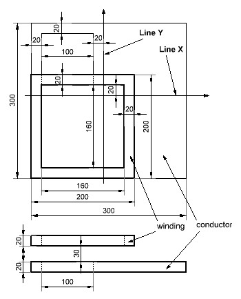              |
|  :-:                                     |
| Fig.2. Region sizes for the test example.|
 
&emsp;A sinusoidal current with an amplitude of $183 A$ and a frequency of $50 Hz$ is set in the winding. The electrical conductivity of the conductor is $\sigma=35.26\cdot 10^6 S/m$  
&emsp;Below in  <a id="Fig.3">Fig.3</a> are screenshots taken in **Elmer FEM** and **VoxCAD** (geometry prepared for **EC3D.exe**). The  **/for_Elmer** directory contains an archive [eddy_currents.7z](./for_Elmer/eddy_currents.7z)  with a mesh and a task for **Elmer FEM**.  Geometry and data for calculation in **EC3D** are contained in the file **compare_to_Elmer.vxc** in the directory **/src**

|&emsp;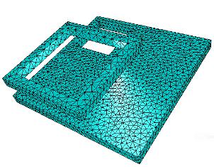|&emsp;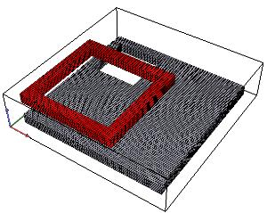 | 
|  :-:                     |:-:                         | 
|a) geometry for **ElmerFEM**|b) geometry for **EC3D** (prepared in **VoxCAD**) |
 
&emsp;&emsp;&emsp;&emsp; Fig.3. Screenshots of geometry for calculations in **ElmerFEM** and **EC3D**. 

&emsp;The **Elmer FEM** tetrahedral mesh geometry contains $13244$ nodes and $111042$
 elements. The total size of the calculation area is **494mm x 494mm x 494mm**.  
&emsp;For **EC3D**, the physical domains are arranged in cells of a regular hexagonal mesh. The total size calculation area is **340mm x 340mm x 80mm**. The number of cells is $249696$.  
&emsp;The model time of the transient process is set to $0.1 sec$, the number of steps is set to $100$.   
&emsp; The calculation in **Elmer FEM** took about $1200 sec$, for **EC3D** this time was about $365 sec$ (from here on the execution time is given for the executable file compiled in **gfortran**).  
  
&emsp; Below in Fig. 4 the results of the calculation of the eddy current field on the plate surface are shown, displayed in **Paraview**. **Line X** and **Line Y** are highlighted.

|&emsp;&emsp;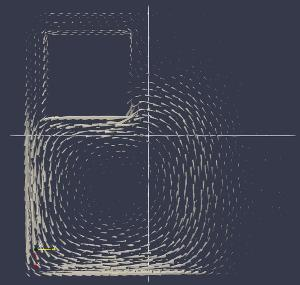|&emsp;&emsp;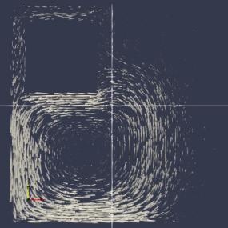 | 
|  :-:                                  |:-:                         | 
|a) **Elmer FEM**                                  |b) **EC3D**                |
  
&emsp;&emsp;&emsp;&emsp; Fig.4. Screenshots of the eddy current field on the surface of the plate at time t=0.017sec. 
  
  Below in Fig. 5 are graphs of the magnitude and **x**- **y**- components of the eddy current density on the surface of the plate along the **Line X** and **Line Y** at time t=0.017sec.  The positive directions of lines **Line X** and **Line Y**  are shown in  [Fig. 2.](#Fig.2)   
  
|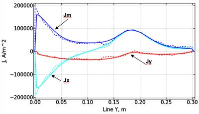|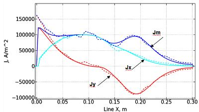|
|  :-:                        |:-:                          | 
|a) eddy current density  along **Line Y**|b) eddy current density along **Line X**|

&emsp; Fig.5. Graphs  of the eddy current density. Solid lines of the graphs correspond to calculations in the **EC3D**, dashed lines correspond to calculations in the **Elmer FEM**.  
  
&emsp; It can be seen from Fig. 5 that the simulation results obtained in **EC3D** are in good agreement with the results obtained in **Elmer FEM**. Some local discrepancies may be due to the fact that **Elmer FEM** better tracks the complex trajectory of eddy currents, and some non-smoothness of the graphs may be due to the insufficiently fine mesh of **Elmer FEM**.  
  
#### An example of test problem preparation.

&emsp; Here we will give some rules for composing a problem for calculating eddy currents, given in the file **compare_to_Elmer.vxc** (the geometry introduced in **VoxCAD** is shown in [Fig. 3b.](#Fig.3)).  
General view of the **VoxCAD** editor:  
  
&emsp; &emsp; &emsp; 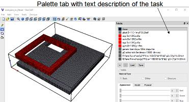 
  
The text data of the task is entered in the **Palette** tab.  
&emsp; General notes: All strings consist of words separated by spaces or "=". When processed, the "=" sign is replaced by a space. All characters are converted to uppercase. The first word is the string name, this word is required, although not used yet.  
&emsp; The string contains keywords and the values ​​assigned to the keywords.  
In our case, this is the following text:
```
                plast D=1 C='mu0*35.26e6'
                axp D=1 SRCx=Fp
                axm D=1 SRCx=Fm
                ayp D=1 SRCy=Fp
                aym D=1 SRCy=Fm
                param  tran stop=100m step=1m
                p2 solver tol=5m itmax=10000  dir=vec
                f1 func Fp=a*cos(p2*f*t) a='183/(6*dx*6*dz)' p2='2*pi' f=50 t=t 
                f2 func Fm=a*cos(p2*f*t) a='-183/(6*dx*6*dz)' p2='2*pi' f=50 t=t
```  
The keywords in the description below are in quotation marks, but in the **Palette** tab they should be without quotation marks.  

* **plast**  string. Keyword “D” - diffusion coefficient is equal to 1.  The domain corresponds to an aluminum plate with  conductivity **$\sigma=35.26\cdot10^6$**. The keyword “C” - is the inertial coefficient. ([look _Equations of conducting region_](#eq2)) is calculated using the formula **$\mu_0\cdot\sigma$**.   
* **axp**  string. This is the part of the coil, along the **x** axis , in which the current will flow in the positive direction. The current source vector in the **x** direction in the domain is specified by the keyword "SRCx” and a reference to the function **Fp**.   
* **axm**  string. This is the part of the coil, along the **x**, axis , in which the current will flow in the negative direction. The current source vector in the **x** direction in the domain is specified by the keyword "SRCx” and a reference to another function: **Fm**.   
* **ayp** and **aym**  strings . Similarly, they specify the vector current source for parts of the coil in the **y** direction . The current source vector in the **y** direction in the domain is specified by the keyword "SRCy” and a reference to the functions  **Fp** and **Fm**.    
Since all elements of the coil are located in the air, the coefficient “D” for them is equal to 1.    
*  **param** string. After the keyword "tran" - the parameters of the transient process in seconds are set:  
&emsp; &emsp; The keyword "stop" is the time of the transient process. This is a variant of the value with a prefix: 100m, i.e. 100е-3. (More about prefixes <https://github.com/JNSresearcher/convert_prefix>) ;   
&emsp; &emsp; The keyword  "step" - is the time step;  
&emsp; &emsp; You can use the keyword "jump" -  is the time jump for outputting the results to a file;  
* **p2** string. After the keyword "solver" -  the solver parameters are set:  
&emsp; &emsp; The keyword  "tol" - convergence criterion.  
&emsp; &emsp; The keyword  "itmax" - maximum number of iterations ;  
&emsp; &emsp; The keyword  "dir" -   The same line sets the name for the output directory: **vec**.  
* **f1** string. After the keyword "func”, the description of the function  **Fp** is entered: after the "=” sign, the symbolic expression of the function is written without spaces, then the values ​​of the arguments. The symbolic expression: **a\*cos(p2\*f\*t)** has 4 arguments  **a**, **p2**,**f**, **t**. Numeric values ​​​​are assigned to the arguments immediately after the function. The **a** argument enters the current density in the coil. Here it is calculated by dividing the coil current (183 A) by the cross-sectional area of ​​the coil (6\*dx\*6\*dz), where 6 is the number of cells in x and z). In this version the coil cross-sectional area is entered manually. In the future it is planned to be calculated automatically. The **p2** argument set the number $2\cdot\pi$, the **f** argument set the frequency of the current in the coil. The keyword "t” is assigned to the argument **t**  "t". During the calculation, the calculated time will be assigned to this argument.   
* **f2** strings. After the keyword "func”, the description of the function  **Fm** is entered. This line is similar to the f1 line, except that the amplitude is assigned a negative number.  
**Note.** Symbolic expressions for arguments, given in quotes contains numbers and constants in the form of symbols. There must be no prefixes in the numbers. The following constants can be used as symbols:  
&emsp; &emsp; **dx**, **dy**, **dz** - grid steps along **x,y,z**.  
&emsp; &emsp; **Nx**, **Ny**, **Nz** - size of the calculation area along **x,y,z**.  
&emsp; &emsp; **time**, **dt** - transient time and time step.  
&emsp; &emsp; **pi, e, mu0, e0** : $\pi=3.1415... , \epsilon=2.7182..., \mu_0=0.12566...10^{-5}, \epsilon_0=0.88541...10^{-11}$, respectively.  

***
### Example of a moving coil
&emsp; The task is in the file **ec_src_move_hole.vxc**  
&emsp; The geometry of the problem is similar to the previous one, except that the dimensions of the coil are reduced by half. The cross-sectional area of ​​the coil remains the same. The coil moves at a given speed along an ellipse above the conductor in a plane perpendicular to the surface of the conductor.  
&emsp; The figure below shows the view of the working area and the calculation results (current vectors in the coil and the eddy current density field in the plate):  

|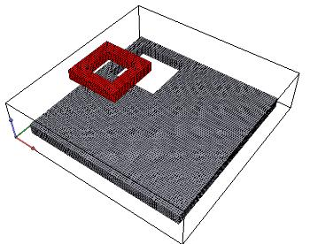 | 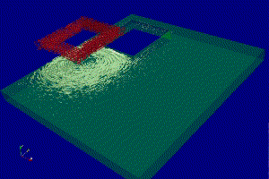|
|  :-:                            |:-:                          | 
| a) geometry prepared in **VoxCAD**|b) displayed result in **Paraview** |

&emsp;&emsp;&emsp;&emsp; Fig.6. Screenshots of geometry and calculation results  
  
The calculation time was about $295 sec$  
Text entered on the  **Palette** tab:  
```
            plast D=1 C='mu0*35.26e6'
            axp D=1 SRCx=Fp  Vsx=Vmx  Vsy= Vmy
            axm D=1 SRCx=Fm  Vsx=Vmx  Vsy= Vmy
            ayp D=1 SRCy=Fp  Vsx=Vmx  Vsy= Vmy
            aym D=1 SRCy=Fm  Vsx=Vmx  Vsy= Vmy
            p1 param  tran stop=40m step=0.4m
            p2 solver tol=5m itmax=10000  dir=vec
            f1 func Fp=a*cos(p2*f*t) a='183/(6*dx*6*dz)'  p2='2*pi' f=50 t=t 
            f2 func Fm=a*cos(p2*f*t) a='-183/(6*dx*6*dz)' p2='2*pi' f=50 t=t 
            m1 func Vmx=a*p2*f*sin(p2*f*t) a='dX*(Nx-42)/2'  p2='2*pi' f=25 t=t 
            m2 func Vmy=a*p2*f*cos(p2*f*t) a='-dY*(Ny-42)/2' p2='2*pi' f=25 t=t
```
Let us give some explanations.Since the problem is similar to the previous problem, we will dwell in more detail on the differences associated with the assignment of the mechanical movement of the coil.
  
* **plast**  string. The domain corresponds to an aluminum plate. This string does not change.  
* **axp**  string. This is the part of the coil, along the **x** axis , in which the current will flow in the positive direction. Then information is given about the movement of this part of the coil. After the keywords "Vsx” and "Vsy” there are references to the functions that calculate the speeds of this part of the coil: **Vmx** and **Vmy**.   
&emsp; &emsp; For other parts of the coil there should be the same functions.  
* **axm**  string. This is the part of the coil, along the **x**, axis , in which the current will flow in the negative direction.   
* **ayp** and **aym**  strings . Similarly, they specify the vector current source for parts of the coil in the **y** direction .  
* **p1** and **p2** strings.  These lines specify time intervals, solver parameters, and the directory name for output files. 
* **f1** **f2**   strings describe the functions of changing the currents in the coils in the positive and negative directions, respectively. These strings does not change.  
* **m1**, **m2**   strings describe the parametric functions for calculating the coil speed along **x** and **y** axis. The trajectory is specified as a function of time for velocities along  **x** and **y** coordinates. In this case, it is a ellipse line. The parametric definition of a ellipse line for the coordinates is known:  
&emsp;&emsp; $x=a\*sin(2\*\pi\*f\*t)$   
&emsp;&emsp; $y=b\*cos(2\*\pi\*f\*t)$,   
where  **a** and **b** are the semi-axes of the ellipse, **f** - frequency,  **t** - time (parameter).  
&emsp; After differentiation with respect to time, we obtain expressions for the velocities:  
&emsp;&emsp; $dx/dt= a\*2*\pi\*f\*cos(t)$   
&emsp;&emsp; $dy/dt=-b\*2*\pi\*f\*sin(t)$   
&emsp;The values ​​of the coefficients **a** and **b** are selected in such a way that the trajectory is located only above the conductor:  
&emsp; &emsp; $a = dX\*(Nx-42)/2,  b = dY\*(Ny-42)/2$,  
where **Nx**, **Ny** - size of the calculation area along **x** and **y**. **dX**, **dY** - grid steps along **x,y**.  The doubled distance from the conductor to the boundary of the calculation area is equal to 12 cells , the width and length of the coil is 30 cells. In total, 30+12 this is 42 cells. When calculating the semi-axes of the ellipse, the obtained numbers are taken into account.  
&emsp; It should be noted that the initial coordinates of the trajectory correspond to the value of the parameter **t=0** and the initial coordinates of the coil placement.
  
### Example with a linear induction machine (LIM)
&emsp; The initial data for the task is in the **LIM.vxc** file.   
  
&emsp;The three-phase winding creates a "running" magnetic field in the positive direction of the **X**-axis and performs a reciprocating motion along the same axis. In the forward direction of the winding movement, the field speed and the winding speed coincide, while in the reverse direction, the speeds are opposite.
&emsp; The figure below shows the view of the working area and the calculation results (moving winding and eddy current density field in the plate):  

|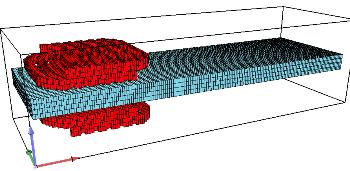 | &emsp;&emsp;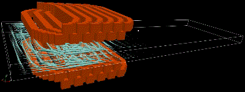|
|  :-:                            |:-:                          | 

&emsp;&emsp; Fig.7. Screenshots of geometry and calculation results of reciprocating motion of a linear induction machine.  
  
The total size calculation area is **880mm x 304mm x 220mm**. The number of cells is $123904$. The model time of the transient process is set to $0.2 sec$, the number of steps is set to $200$.  The calculation took about $105 sec$.  
&emsp;Next, Fig. 8 shows the change in the transverse component of the eddy current density at a point on the surface of the conductor.  The eddy current is generated when the winding moves above the point. 

&emsp;&emsp;&emsp;&emsp;&emsp;&emsp;&emsp; 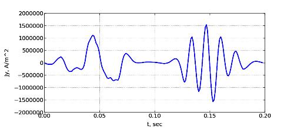  
&emsp;&emsp;  Fig.8. Graph of the change in the transverse component of the eddy current density at a point on the surface of the conductor.   
  
In the figure, at t=0.1sec, the direction of movement changes. It is clearly seen that the eddy current frequency is lower for the forward direction of the winding movement than for the reverse direction (in this case, the frequency of the current in the winding remains constant and is 50 Hz). 


### Conclusion
&emsp; In general, the proposed approach allows performing sketch calculations of eddy currents in three-dimensional space when there are no high requirements for the geometry of the problem  and there are no magnetized areas.  
  
  
***
  
 ***
