3D eddy current modeling for sketch calculations

### 1 Formulations
&emsp;  Fig. 1 shows the general layout of the objects.  

| 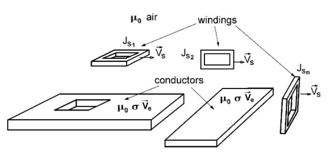  |
|  :-:                                                      |
| Fig.1. Sketch of the geometric arrangement of the calculation regions.|
  
&emsp; In the air environment (magnetic permeability of air **$\mu_0$**) there are several conductive regions with the same conductivity **$\sigma$**  and   **$n$** windings with a given current density **$\vec{J_{s1}},...\vec{J_{sn}}$**. All windings can move at the same speed (without rotation) **$\vec{V}_s$**. If the coils velocity **$\vec{V}_s$** is specified, then the conducting region is automatically assigned the velocity in Euler coordinates **$\vec{V}_{e} = -\vec{V}_{s}$**.  
&emsp; Partial differential equations are solved in the time domain for the vector magnetic potential $\vec A$ and the scalar electric potential $U$.  
   
<a id="eq1">**Equations of non-conducting region:**</a>
<table><tr> 
<td>
$$   \nabla^2 \vec{A} = -\mu_0 \vec{J}_s(t,x,y,z) $$ 
</td>
</tr></table>  
  
<a id="eq2">**Equations of conducting region:**</a>
<table><tr> 
<td>
$$  \nabla^2 \vec{A}-\mu_0\sigma \left(\frac{\partial \vec{A}}{\partial t} +\nabla U + (\vec{V}_e \cdot\nabla) \vec{A}  \right)= 0  $$ 
  
$$  \nabla^2 U + \nabla \cdot \left( \frac{\partial \vec{A}}{\partial t} + (\vec{V}_e\cdot\nabla) \vec{A} \right) = 0 $$ 
</td>
</tr></table>

**Equation for calculating eddy current:**
<details>
      <summary> <<<< expand</summary>
      <p>
<table><tr> 
<td>
$$ \vec{J_e} = \sigma \left( \frac{\partial \vec{A}}{\partial t} +\nabla U + (\vec{V}_e\cdot\nabla) \vec{A}   \right) $$
</td>
</tr></table>
      </p>
</details>
         
&emsp;For clean the eddy currents from divergence (it is required that $\nabla \cdot \vec{J_e}=0$ ) 
the Hodge-Helmholtz projection method was used by solving the Poisson equation
<table><tr> 
<td>
$$ \nabla^2 \phi = \nabla \cdot \vec{J_e}^n; &emsp; \vec{J_e}^{n+1} = \vec{J_e}^n - \nabla\phi $$
</td>
</tr></table>

To derive these equations, I used the information given in the [Bibliography](#bibliog).   

**Matrix form of equations for calculations:**
<table><tr> 
<td>
$$
\begin{aligned}
\begin{bmatrix}
\nabla^2-\mu_0\sigma \frac{\partial}{\partial t} &  &  & -\mu_0\sigma\frac{\partial}{\partial x}  \\
     & \nabla^2 -\mu_0\sigma \frac{\partial}{\partial t}  &  & -\mu_0\sigma\frac{\partial}{\partial y}  \\
  &   & \nabla^2 -\mu_0\sigma \frac{\partial}{\partial t}  & -\mu_0\sigma\frac{\partial}{\partial z}  \\
\frac{\partial}{\partial x} \frac{\partial}{\partial t} & \frac{\partial}{\partial y} \frac{\partial}{\partial t} & \frac{\partial}{\partial z} \frac{\partial}{\partial t} & \nabla^2
\end{bmatrix} \cdot
\begin{bmatrix}
A_x  \\
A_y  \\
A_z \\
U 
\end{bmatrix} =
\begin{bmatrix} 
\mu_0\sigma\vec{V}_e\cdot\nabla A_x  \\
\mu_0\sigma\vec{V}_e\cdot\nabla A_y   \\
\mu_0\sigma\vec{V}_e\cdot\nabla A_z  \\
-\nabla \cdot (\vec{V}_e\cdot\nabla) \vec{A}
\end{bmatrix} 
\end{aligned}
 $$
</td>
</tr></table>

&emsp;In this matrix equation, the velocity-dependent components are placed on the right-hand side. The values ​​of the vector potential in the vector of the right sides are determined from the results obtained in the previous calculation step.    
&emsp; Boundary conditions: open boundaries for magnetic vector potential.   For the electric scalar potential, zero Neumann conditions for the normal component at the boundary of the conducting region. Also at the boundary of the conducting region, zero normal components for eddy currents.  
&emsp;Using finite difference approximation, the equations are reduced to a sparse system of algebraic equations, which are solved by the BiConjugate Gradient Stabilized with restart method  (**$BiCGSTABwr$**) or by direct methods using the library **$mkl$** **$pardiso$**. 
The _BiCGSTABwr_ method is discussed [here](https://github.com/JNSresearcher/SOLVERS_BCGSTAB_GMRES).  
&emsp;  In numerical calculations for a non-conducting region, to determine the **$x,y,z-$** coordinates of the location of external current sources in the coils at time step $i+1$, equations of the form **$x_{i+1}=x_i + Vs_x\cdot dt$** are used, where **$Vs_x$** is the speed of movement of the coil along the coordinate **$x$**, **$dt$** - calculated time step. Similarly, for the remaining coordinates, the speeds of mechanical movement of the coils must be specified: **$Vs_y, Vs_z$**.   

### 2 Required Software 
Assembly and testing were done in _Windows_ (but _Linux_ is not excluded).  
- [**VoxCad**](https://sourceforge.net/projects/voxcad/files/VoxCAD1000-x64.msi/download) - the simplest 3D editor for data preparation ([here](https://sourceforge.net/projects/voxcad/files/VoxCad0992.tar.gz/download) is a version for  **Linux**); The data is saved in its native format **vxc**. This is a text format, except for the voxel geometry data. This information is compressed by the _zlib_ library (but there is an option to save data in full text format).  
- **gfortran** or **ifort** (both Fortran2018). For calculations with **gfortran** using _Intel mkl pardiso_ you will need the files of this library _mkl_rt.2.dll, mkl_core.2.dll, mkl_intel_thread.2.dll_. Since _Intel oneAPI Fortran_ is freely distributed, you can install it and specify the path to these files, as is done in the _Makefile_ provided here. These files are also included in _Anaconda3_. They can also be found on the [website](https://www.dllme.com).  
- **Python2** or **Python3** (optional) - for data decompression ( I used  **Python3** as part of **Anaconda3**, which includes the **zlib** library for **Python**). If the **vxc** file contains data in uncompressed ASCII format, then there is no need for **Python**. For example, on can use the [**Voxcraft-viz**](https://github.com/voxcraft/voxcraft-viz) analogue with higher quality 3D graphics, which by default stores data in ASCII;  
- **make**  for build;  
- [**ParaView**](https://www.paraview.org/)  to display calculation results in **vtk** format files.  

### 3 Repository Structure
Directory **/src**:  

- **EC3D.f90**  - main program;   
- **m_vxc2data.f90** - module for sharing data obtained when converting data from a **VoxCad** file;  
- **vxc2data.f90** - program for converting data from a **VoxCad** file;   
- **solvers.f90** - linear equation solver using  _BiCGSTABwr_ methods ;  
- **utilites.f90** - contains routines for different tasks (convert a string to an array of words, convert to upper case, representation of a 3D image in **vtk**, converting a word to a number;  
- **m_fparser.f90** - parser for calculating functions specified in the lines of a **VoxCad** file. Adapted from source files, available from <http://fparser.sourceforge.net>;   
- **uncompress_zlib2.py** and **uncompress_zlib3.py** - for create a temporary file with converted uncompressed data into ACSII for later processing;  
-  **Makefile** - creating an executable using **make**.  

&emsp;Files in **VoxCad** format with examples of tasks for calculations in the time domain:  

- **compare_to_Elmer.vxc**  for solve the test problem and compare the results with **Elmer FEM**;  
- **compare_to_Agros.vxc**  for solve the test problem and compare the results with **Agros2d**;  
- **ec_src_moveXYZ_hole.vxc**  example of a moving coil;  
- **LIM.vxc**  example with a linear induction machine.  

Directory **/for_compar** contains archives for comparative calculations in **ElmerFEM** and **Agros2d**.

### 4 Build  
&emsp; To build the  executable file **EC3D.exe**, should be configure the **makefile**. The executable file can be created using the **gfortran** or **ifort** compilers. To configure, on need to comment/uncomment the top lines, for example, for  **gfortran**:   
```
        F90=gfortran  
        # F90=ifort
```  
&emsp; Type **make** at the command prompt and run.  

### 5 Launch of calculation  
&emsp; At first, on need to save the data, for example **example.vxc**, to a working file named **in.vxc** in the same directory as the **EC3D.exe** executable.  
Next run the executable file: **EC3D.exe**. As a result, output files will be created: with extensions  **vtk**. 

### 6 Output information
&emsp; The calculation results are written to files with the extension **vtk**, which are located in the directory **/out**, where **out** - the name that is specified in the source data (this name is set by default). The following sets of files are generated:  
&emsp; **field_\*.vtk**  for displaying a 3D field and **src_\*.vtk** - for displaying coils on an unstructured grid. The number of files corresponds to the number of calculated points in time.

### 7 Validation
### 7.1 Testing the Fixed Coil Example
&emsp;A modified version of benchmark problem No.7 of the International TEAM (Testing Electromagnetic Analysis Methods) Seminar was used for testing.  Test Problem of TEAM7 involves calculating eddy currents in an asymmetric conductor with a hole. The magnetic field is induced by a coil with alternating current located above the conductor. The complete solution to this test in [Elmer FEM](https://www.elmerfem.org/blog/binaries) is given in  [TEAM7](https://github.com/ElmerCSC/elmer-elmag/tree/main/TEAM7). In the modified version, the shape and height of the coil were changed, some dimensions were slightly adjusted and the amplitude of the coil current was changed. During validation, the results of calculations in [Elmer FEM](https://www.elmerfem.org/blog/binaries) and **EC3D.exe** were compared.  
&emsp; <a id="Fig.2">Figure 2</a> shows the sizes of the regions for the test example. The control lines **Line H1**, **Line V1**, **Line H2**, **Line V2** are located on the surface of the plate. 

| 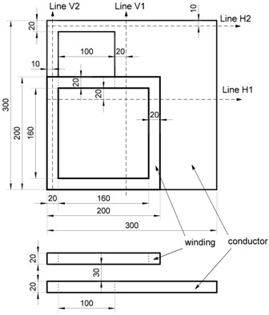              |
|  :-:                                     |
| Fig.2. Region sizes for the test example.|
 
&emsp;A sinusoidal current with an amplitude of $183 A$ and a frequency of $50 Hz$ is set in the winding. The electrical conductivity of the conductor is $\sigma=35.26\cdot 10^6 S/m$  
&emsp;Below in  <a id="Fig.3">Fig.3</a> are screenshots taken in **Elmer FEM** and **VoxCAD** (geometry prepared for **EC3D**). The  **/for_compar** directory contains an archive [for_compare_with_Elmer.7z](./for_compar/for_compare_with_Elmer.7z)  with a mesh and a task for **Elmer FEM**.  Geometry and data for calculation in **EC3D** are contained in the file **compare_to_Elmer.vxc** in the directory **/src**

|&emsp;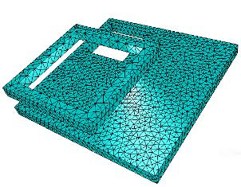|&emsp;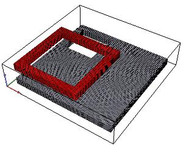 | 
|  :-:                     |:-:                         | 
|a) geometry for **ElmerFEM**|b) geometry for **EC3D** (prepared in **VoxCAD**) |
 
&emsp;&emsp;&emsp;&emsp; Fig.3. Screenshots of geometry for calculations in **ElmerFEM** and **EC3D**. 

&emsp;The **Elmer FEM** tetrahedral mesh geometry contains $13244$ nodes and $111042$
 elements. The total size of the calculation area is **494mm x 494mm x 494mm**.  
&emsp;For **EC3D**, the physical domains are arranged in cells of a regular hexagonal mesh. The total size calculation area is **340mm x 340mm x 80mm**. The number of cells is $249696$.  
&emsp;The model time of the transient process is set to $0.1 sec$, the number of steps is set to $100$.   
&emsp; The calculation in **Elmer FEM** took about **1200sec**. For **EC3D** this time was about **397 sec** for the **BCG** solver with **tol=5** and **232 sec** with **tol=10**. For the **PRD** solver the calculation time was **415 sec** (with 11 Gigabytes of RAM!). From here on the execution time is given for the executable file compiled in **gfortran**.  
  
&emsp; Below in Fig. 4 the results of the calculation of the eddy current field on the plate surface are shown, displayed in **Paraview**. 

|&emsp;&emsp;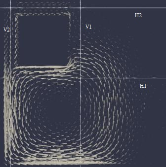|&emsp;&emsp;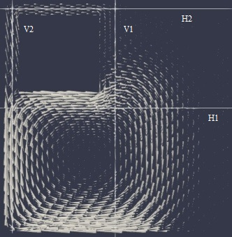 | 
|  :-:                                  |:-:                         | 
|a) **Elmer FEM**                                  |b) **EC3D**                |
  
&emsp;&emsp;&emsp;&emsp; Fig.4. Screenshots of the eddy current field on the surface of the plate at time t=0.017sec. 
  
  Below in Fig. 5 are graphs of the **x**- **y**- components of the eddy current density on the surface of the plate along the control lines at time t=0.017sec.  The positive directions along the control lines are shown in  [Fig. 2.](#Fig.2)   
  
|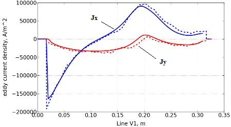|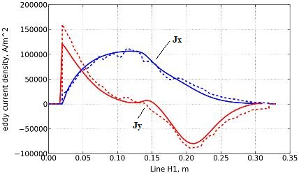|
|  :-:                        |:-:                          | 
|a) eddy current density  along **Line V1**|b) eddy current density along **Line H1**|
  
|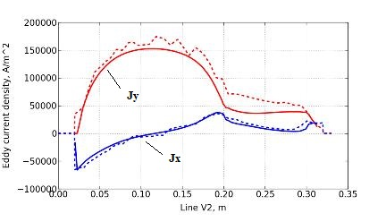|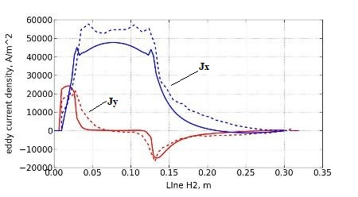|
|  :-:                        |:-:                          | 
|c) eddy current density  along **Line V2**|d) eddy current density along **Line H2**|
&emsp; Fig.5. Graphs  of the eddy current density. Solid lines of the graphs correspond to calculations in the **EC3D**, dashed lines correspond to calculations in the **Elmer FEM**.  
  
&emsp; It can be seen from Fig. 5 that the **EC3D** (_Intel mkl pardiso_ library used) simulation results agree well with the **Elmer FEM** results in areas close to the center of the plate. Further from the center, there is a noticeably larger discrepancy with **Elmer**. This is especially noticeable for *Jx* along **Line H2**  and *Jy* along **Line V2**. 
  
### 7.1.1  An example of test problem preparation.

&emsp; Here we will give some rules for composing a problem for calculating eddy currents, given in the file **compare_to_Elmer.vxc** (geometry created in **VoxCAD** is shown in [Fig. 3b.](#Fig.3)).  
General view of the **VoxCAD** editor:  
  
&emsp; &emsp; &emsp; 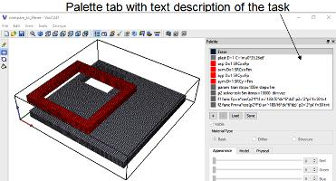 
  
The text data of the task is entered in the **Palette** tab.  
&emsp; General notes: All strings consist of words separated by spaces or "=". When processed, the "=" sign is replaced by a space. All characters are converted to uppercase. The first word is the string name, this word is required, although not used yet. The second word defines the contents of the line.   
&emsp; The string contains keywords and the values ​​assigned to the keywords.  
&emsp;  If the line name is followed by the second word **region**, then this region must be displayed in the editor's working field. The region parameters must be specified in this line.
In this project, only two types of region are provided: conductive region and current source (the rest of the space is considered air by default).  
&emsp; If the keyword **region** is not specified in the line, then this line will correspond to the calculation parameters and nothing needs to be displayed in the working field.  
&emsp; In our case we have the following text::
```
                plat region C=35.26e6
                axp region SRCx=Fp
                axm region SRCx=Fm
                ayp region SRCy=Fp
                aym region SRCy=Fm
                p1  tran stop=100m step=1m
                s1 solver tol=5m itmax=10000 solv=prd dir=forElmeer
                f1 func Fp=a*cos(p2*f*t) a='183/(6*dx*6*dz)' p2='2*pi' f=50 t=t 
                f2 func Fm=a*cos(p2*f*t) a='-183/(6*dx*6*dz)' p2='2*pi' f=50 t=t
```  
The keywords in the description below are in quotation marks, but in the **Palette** tab they should be without quotation marks.  

* **plat**  string.  The domain corresponds to an aluminum plate with  conductivity **$\sigma=35.26\cdot10^6 S/m$**. The keyword “C”  is the conducting **$\sigma$** ([look _Equations of conducting region_](#eq2)).   
* **axp**  string. This is the part of the coil, along the **x** axis , in which the current will flow in the positive direction. The current source vector in the **x** direction in the domain is specified by the keyword "SRCx” and a reference to the function **Fp**.   
* **axm**  string. This is the part of the coil, along the **x**, axis , in which the current will flow in the negative direction. The current source vector in the **x** direction in the domain is specified by the keyword "SRCx” and a reference to another function: **Fm**.   
* **ayp** and **aym**  strings . Similarly, they specify the vector current source for parts of the coil in the **y** direction . The current source vector in the **y** direction in the domain is specified by the keyword "SRCy” and a reference to the functions  **Fp** and **Fm**.    
*  **p1** string. After the word "tran" - the parameters of the transient process in seconds are set:  
&emsp; &emsp; The keyword "stop" is the time of the transient process. This is a variant of the value with a prefix: 100m, i.e. 100е-3. (More about [prefixes](https://github.com/JNSresearcher/convert_prefix) );   
&emsp; &emsp; The keyword  "step" - is the time step;  
&emsp; &emsp; You can use the keyword "jump" -  is the time jump for outputting the results to a file;  
* **s1** string. After the word "solver" -  the solver parameters are set:  
&emsp; &emsp; The keyword  "tol" - convergence criterion.  
&emsp; &emsp; The keyword  "itmax" - maximum number of iterations ;  
&emsp; &emsp; The keyword  "solv" - solver type. There are two options. **BCG** (default) for _BiCGSTABwr_ and **PRD** for _Intel mkl pardiso_. If the **PRD** solver is specified, the **tol** and **itmax** options are ignored.  
&emsp; &emsp; The keyword  "dir" -   The same line sets the name for the output directory: *ForElmer*.  
&emsp; &emsp; The keyword  "python" - In this line you can specify the version of python after the keyword "python". For example python=2 (default python=3).  
* **f1** string. After the word "func”, the description of the function  **Fp** is entered: after the "=” sign, the symbolic expression of the function is written without spaces, then the values ​​of the arguments. The symbolic expression: **a\*cos(p2\*f\*t)** has 4 arguments  **a**, **p2**,**f**, **t**. Numeric values ​​​​are assigned to the arguments immediately after the function. The **a** argument enters the current density in the coil. Here it is calculated by dividing the coil current (183 A) by the cross-sectional area of ​​the coil (6\*dx\*6\*dz), where 6 is the number of cells in x and z). In this version the coil cross-sectional area is entered manually. In the future it is planned to be calculated automatically. The **p2** argument set the number $2\cdot\pi$, the **f** argument set the frequency of the current in the coil. The keyword "t” is assigned to the argument **t**  "t". During the calculation, the calculated time will be assigned to this argument.   
* **f2** strings. After the word "func”, the description of the function  **Fm** is entered. This line is similar to the f1 line, except that the amplitude is assigned a negative number.  
**Note.** Symbolic expressions for arguments, given in quotes contains numbers and constants in the form of symbols. There must be no prefixes in the numbers. The following constants can be used as symbols:  
&emsp; &emsp; **dx**, **dy**, **dz** - grid steps along **x,y,z**.  
&emsp; &emsp; **Nx**, **Ny**, **Nz** - size of the calculation area along **x,y,z**.  
&emsp; &emsp; **time**, **dt** - transient time and time step.  
&emsp; &emsp; **pi, e, mu0, e0** : $\pi=3.1415... , \epsilon=2.7182..., \mu_0=0.12566...10^{-5}, \epsilon_0=0.88541...10^{-11}$, respectively.  
  
  
***
### 7.2 Testing the moving coil example
&emsp; The verification of the calculations for the moving coil consisted of calculating the eddy currents in an extended conducting plate. The magnetic field is induced by an alternating current coil located above the conductor and moving along the plate at a constant speed.  
&emsp; For verification calculations with a moving coil, the **[Agros2d](https://agros2d.org/web/)** program was selected. **Agros2d** is intended only for two-dimensional problems with stationary objects. However, the relative speed of the coil and the conductor can be specified as a property of the conductor (in Euler coordinates). The conductor is assumed to be "infinitely" extended along the coordinate along the motion. In the three-dimensional analogue of this problem, the cutting plane is located along one coordinate along the motion, and along the second coordinate in the perpendicular direction.   
&emsp; Figure 6 shows the sizes of the regions for the test example. The **X** axis is located on the axis of symmetry and is directed along the plate. For testing, calculations of the y-components of the eddy current density on the surface of the conductor were used.

| 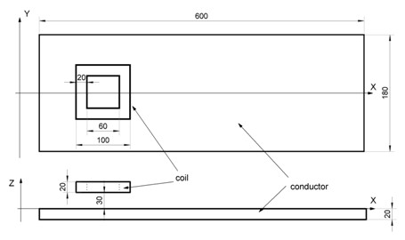              |
|  :-:                                     |
| Fig.6. Region sizes for the test example.|

 &emsp; Below in Fig. 7 are shown the geometry prepared in **VoxCAD** and the results of calculating the eddy current field on the plate surface, displayed in the **Paraview** program.  
The coil is supplied with alternating current with a frequency of **50 Hz** and an amplitude of **183 A**. The cross-sectional area of ​​the coil is **$4 sm^{2}$**. The speed of the coil is **Vs=7.5 m/sec**. The file **compare_to_Agros.vxc** for solving the test problem in **EC3D** and comparing the results with **Agros2d** is located in the **/src** directory.  

|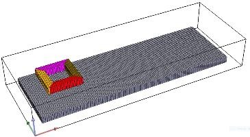 | 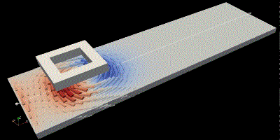|
|  :-:                     |:-:                          | 
| a) prepared geometry in **VoxCAD**|b) displaying the result in  **Paraview** |
&emsp;&emsp; Fig.7. Sscreenshots of geometry created by **VoxCAD** and calculation results obtained in **EC3D** and displayed in **ParaView**

&emsp; Below in Fig. 8 the geometry and results obtained in **Agros2d** are presented. The speed of the plate relative to the coil is **Ve=-7.5 m/sec**. The **/for_compar** directory contains the **for_compare_with_Agros.7z** archive with source data for calculations in **Agros2d**.   

|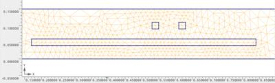 |    |
|  :-:                     |:-:                          | 
| a) geometry prepared in **Agros2d** | b) displayed result in **Agros2d** |

&emsp;&emsp;&emsp;&emsp; Fig.8. Screenshots of geometry and calculation results in **Agros2d**  
  
&emsp; Below in Fig. 9 are presented graphs of the **y** component of the eddy current density on the surface of the plate along the **X** axis (see Fig. 6). 

|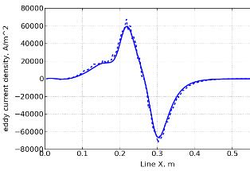|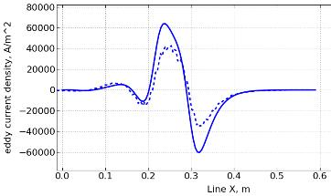 |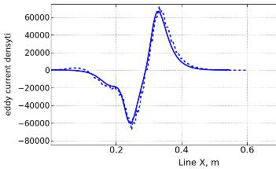|
|  :-:                          |:-:                         | :-: |
|a) **t=17msec**                     |b) **t=22msec**                | **t=27msec**

&emsp; Fig. 9.  Distribution of **y**-components of the eddy current density on the surface of the plate along the **X** axis at different moments in time.  
&emsp;&emsp; Solid lines of the graphs correspond to calculations in the **EC3D**, dashed lines correspond to calculations in the **Agros2d**. 
 

### 8 Calculations of fields of moving coils
### 8.1 Movement of the coil in three coordinates
&emsp; The coil moves with a given speed along an ellipse above the conductor in the plane **XY**, parallel to the surface of the conductor. The distance from the coil to the surface of the conductor changes according to a periodic law. Thus, we have a movement of the coil along three coordinates.  
&emsp; The size of the calculation area is **225mm x 225mm x 70mm** (or in the number of cells: **90x90x28**). The plate thickness is **12.5 mm**. The coil cross-section is **10mm x 10mm**. The amplitude of the coil oscillations in height is **10 mm**.The coil current is **183 A**, the frequency is **50 Hz**. The calculation time of **0.1 sec** with a step of **1 msec** (100 points) was about **175 sec**.    
&emsp; The figure below shows the view of the working area and the calculation results (the eddy current density field in the plate):

|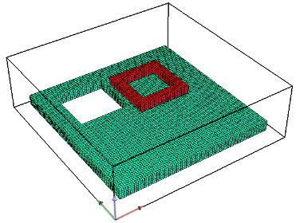 | 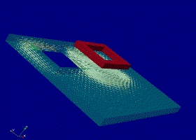|
|  :-:                            |:-:                          | 
| a) geometry prepared in **VoxCAD**|b) displayed result in **Paraview** |
&emsp;&emsp;&emsp;&emsp; Fig.10. Screenshots of geometry and calculation results  
  
&emsp; Here are some explanations for compiling a task for calculation with moving coils. The difference from the task with stationary coils is only in additional information about the mechanical speeds of the coils. The task is in the file **ec_src_moveXYZ_hole.vxc**.  
Text entered on the  **Palette** tab:  
```
            plat region C=35.26e6
            axp region SRCx=Fp  Vsx=Vmx  Vsy= Vmy Vsz= Vmz
            axm region SRCx=Fm  Vsx=Vmx  Vsy= Vmy Vsz= Vmz
            ayp region SRCy=Fp  Vsx=Vmx  Vsy= Vmy Vsz= Vmz
            aym region SRCy=Fm  Vsx=Vmx  Vsy= Vmy Vsz= Vmz
            p1 param  tran stop=100m step=1m
            p2 solver tol=10m itmax=10000  dir=Vxyz
            f1 func Fp=a*cos(p2*f*t) a='183/(4*dx*4*dz)' p2='2*pi' f=50 t=t 
            f2 func Fm=a*cos(p2*f*t) a='-183/(4*dx*4*dz)' p2='2*pi' f=50 t=t 
            m1 func Vmx=a*p2*f*sin(p2*f*t) a='dX*(Nx-55)/2'  p2='2*pi' f=20 t=t 
            m2 func Vmy=a*p2*f*cos(p2*f*t) a='-dY*(Ny-45)/2' p2='2*pi' f=20 t=t
            m3 func Vmz=a*p2*f*sin(p2*f*t) a='dZ*4' p2='2*pi' f=10 t=t 
```
&emsp; Let us dwell only on what is connected with the assignment of the mechanical movement of the coil.  
&emsp; The lines named **axp**, **axm**, **ayp** and **aym** contain the keywords "Vsx", "Vsy, "Vsz" with references to the corresponding functions **Vmx, Vmy** and **Vmz**. The description of these functions is in lines **m1**, **m2**, **m3**, which define parametric formulas for calculating the coil speed along the **x**, **y** and **z** axes.  
&emsp;The trajectory for movement along an ellipse is defined as a function of time for velocities along coordinates **x** and **y** . The parametric definition of the ellipse line is known:  
&emsp; &emsp; $x = a*sin(2*\pi*f*t)$  
&emsp; &emsp; $y = b*cos(2*\pi*f*t)$,  
where  **a** and **b** are the semi-axes of the ellipse, **f** - frequency,  **t** - time (parameter).  
&emsp; After differentiation with respect to time, we obtain expressions for the velocities:  
&emsp; &emsp; $dx/dt =  a*2*\pi*f*cos(2*\pi*ft)$  
&emsp; &emsp; $dy/dt = -b*2*\pi*f*sin(2*\pi*ft)$  
&emsp;The values ​​of the coefficients **a** and **b** are selected in such a way that the trajectory is located only above the conductor:  
&emsp; &emsp; $a = dX*(Nx-55)/2,  b = dY*(Ny-45)/2$,  
where **Nx**, **Ny** - size of the calculation area along **x** and **y**. **dX**, **dY** - grid steps along **x,y**.   
&emsp; Similarly, for oscillations along the z-axis we have the function:  
&emsp; &emsp; $z = -a*cos(2*\pi*f*t)$  
&emsp; The value of the amplitude **a** is chosen so that the trajectory is located above the conductor, but does not touch it. Since the gap is **1.25 cm**, the amplitude of the sinusoid is taken to be **1 cm**. In this case, the amplitude is calculated as $a=dZ*4$, where **dZ** - grid step along **z** (2.5mm). After differentiation we obtain an expression for the velocity along the **z**-axis:  
&emsp; &emsp;  $dz/dt =  a*2*\pi*f*sin(2*\pi*f*t)$  
&emsp; The description of this function is located in line **m3**. The oscillation frequency is taken to be **f=10 Hz**.  
&emsp; It should be noted that the initial coordinates of the trajectory correspond to the value of the parameter **t=0** and the initial coordinates of the coil placement.   
  
### 8.2 Example with a linear induction motor (LIM). Movement with 12 coils.
&emsp; The initial data for the task is in the **LIM.vxc** file.   
  
&emsp;The three-phase winding creates a "running" magnetic field in the positive direction of the **X**-axis and performs a reciprocating motion along the same axis. The plate is divided into two parts. When the coils move in the forward direction, the field speed and the coils speed coincide, and in the opposite direction the speeds are opposite.
&emsp; The figure below shows the view of the working area and the calculation results (moving winding and eddy current density field in the plate):  

|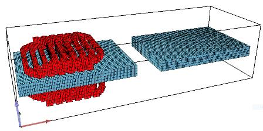 | &emsp;&emsp;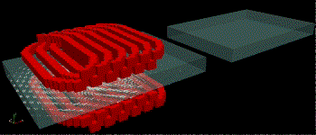|
|  :-:                            |:-:                          | 
|                                 |          |

&emsp;&emsp; Fig.11. Screenshots of geometry and calculation results of reciprocating motion of a linear induction machine.  
  
&emsp;The total size calculation area is **440mm x 160mm x 110mm**  (or in the number of cells: **176x32x22**). Grid steps:  **dx=2.5mm, dy=5mm, dz=5mm**. The model time of the transient process is set to $0.2 sec$, the number of steps is set to $200$.  The calculation took about $151 sec$.  
&emsp;Below, in Fig. 12, the change in the **y** component of the eddy current density is shown, at a point on the surface of the conductor (this point can be seen on the right side of Figure 11).  The eddy current is generated when the winding moves above the point. 

&emsp;&emsp;&emsp;&emsp;&emsp;&emsp;&emsp; 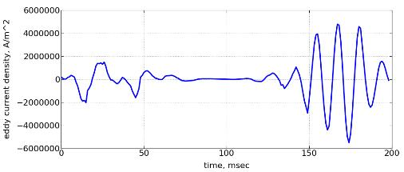  
&emsp;&emsp;  Fig.12. Graph of the change in the transverse component of the eddy current density at a point on the surface of the conductor.   
  
In the figure, at **t=100 msec**, the direction of movement changes. It is clearly seen that the eddy current frequency is lower for the forward direction of the winding movement than for the reverse direction (in this case, the frequency of the current in the winding remains constant and is **50 Hz**). 


***
### <a id="bibliog">Bibliography</a>
1. S. Yamamura, “Theory of linear induction Motors”, John Whiley & Sons, 1972.
ISBN 9780470970904 URL https://www.amazon.com/Theory-Linear-Induction-Motors-Yamamura/dp/0470970901  
2.  F.F. Mende “Consideration and the Refinement of Some Laws and Concepts of Classical Electrodynamics and New Ideas in Modern Electrodynamics”,  International Journal of Physics, 2014, Vol. 2, No. 6, 231-263. URL https://pubs.sciepub.com/ijp/2/6/8  
3. J. Brackbill, D. Barnes, The effect of nonzero $\nabla \cdot B$ on the numerical solution
of the magnetohydrodynamic equations, Journal of Computational Physics 35 (3) (1980) 426–430. doi:10.1016/0021-9991(80)90079-0. URL http://dx.doi.org/10.1016/0021-9991(80)90079-0
  
 ***
Autor <a href="mailto:JNSresearcher@gmail.com">J.Sochor</a>

 *** 
